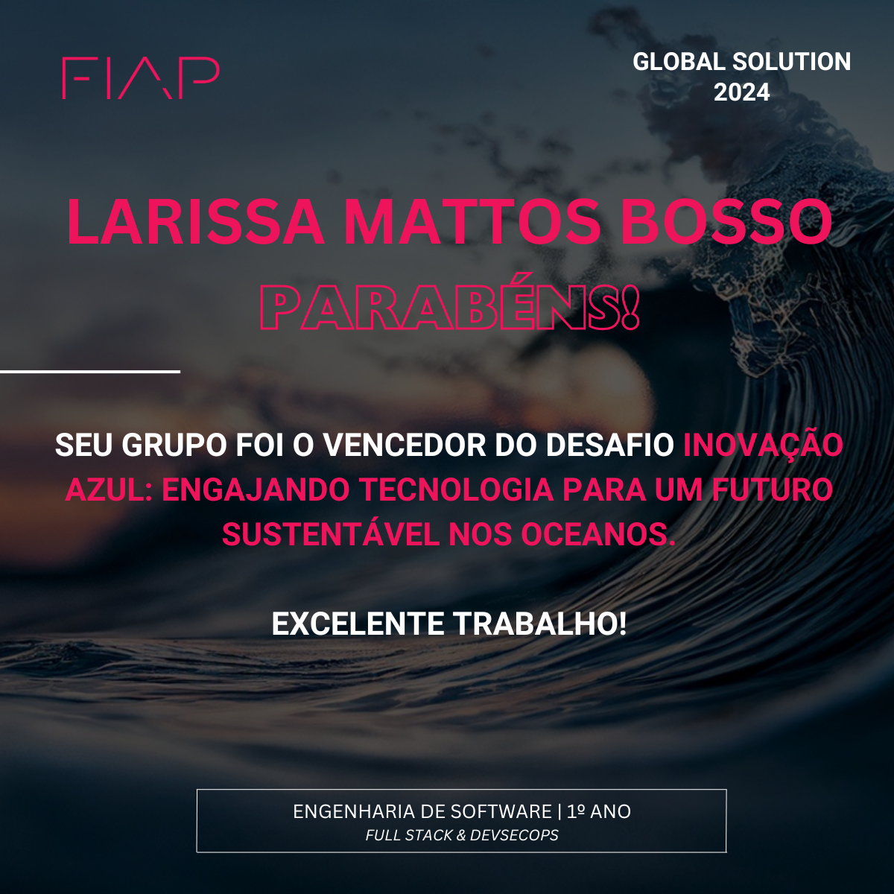

# 🌊 Clemora

**Clemora** é um projeto inovador que tem como missão desenvolver um **robô autônomo para limpeza dos oceanos**, com o objetivo de **preservar a vida marinha e combater a poluição hídrica**. 

🏆 Este projeto foi o **vencedor da Global Solution**, uma proposta de inovação da **FIAP**, voltada para soluções sustentáveis de impacto real no mundo.

---

## 💡 Proposta

A ideia central do Clemora é unir **tecnologia, sustentabilidade e educação**. Nosso projeto é dividido em duas frentes:

### 1. **Robô Clemora**
Um robô físico, inteligente e autônomo, projetado para:
- Recolher resíduos plásticos e sólidos flutuantes no oceano.
- Atuar de forma sustentável, com sensores e painéis solares.
- Reduzir o impacto ambiental nas regiões costeiras e portuárias.

### 2. **Plataforma Educacional**
Além da solução prática, criamos um site educacional interativo para:
- Conscientizar a população sobre os problemas da poluição marinha.
- Ensinar lógica e resolução de problemas com temas ambientais.
- Engajar estudantes e comunidades em prol da vida nos oceanos.

---

## 🌐 Funcionalidades da Plataforma Web

- **🏠 Página Inicial:** Apresentação e vídeo pitch do projeto.
- **📚 Estudos:** Material didático com foco em lógica e sustentabilidade.
- **🧩 Problemas:** Exercícios para desenvolver raciocínio e conscientização.
- **🛠️ Resolução:** Explicações detalhadas das atividades.
- **❓ FAQ:** Respostas dinâmicas para dúvidas frequentes.
- **📰 Notícias:** Atualizações do projeto e do cenário ambiental.

---

## 🛠️ Tecnologias Utilizadas

- HTML5, CSS3, JavaScript
- Layout responsivo
- Scripts para interatividade e envio de formulários

---

## 📽️ Vídeo Pitch

Assista à apresentação oficial do projeto:  
👉 [YouTube - Clemora Pitch](https://www.youtube.com/watch?v=1vUqHJ5Miok)

---

## 🤝 Reconhecimento

🏅 **Projeto premiado na Global Solution - FIAP**  
Um dos projetos mais inovadores em sustentabilidade e tecnologia aplicada à vida marinha.

---

## 📬 Contato

Quer saber mais ou colaborar com o Clemora? Entre em contato com a nossa equipe!

